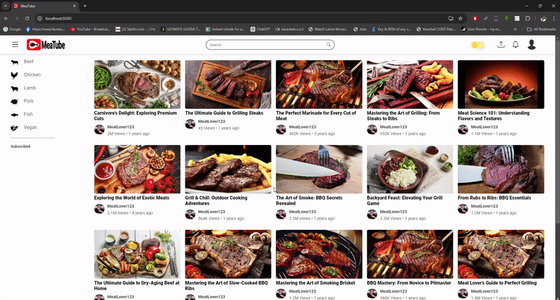

Certainly! Here’s the updated version without using an ordered list.

---

# MeaTube End-to-End Instructions For Web Interface

## Table of Contents

- [Creating a MeaTube Account](#creating-a-meatube-account)
- [Navigating the MeaTube Homepage](#navigating-the-meatube-homepage)
- [Searching for Content](#searching-for-content)
- [Watching a Video](#watching-a-video)
- [Liking, Commenting, and Sharing Videos](#liking-commenting-and-sharing-videos)
- [Uploading a Video](#uploading-a-video)
- [Editing and Deleting a Video](#editing-and-deleting-a-video)

---

## Creating a MeaTube Account

To create an account on MeaTube:

- Open MeaTube in your browser 
- Click on the user icon button located in the top-right corner.
- You will be redirected to a sign-in page. If you don't already have an account, click **Create account** and follow the on-screen instructions to set one up.
- Once you have signed in, you now have access to your MeaTube account.

---

## Navigating the MeaTube Homepage

The MeaTube homepage has several key sections:

- **Search Bar**: At the top of the page, you can use this to search for videos or channels.
- **Home Feed**: Displays recommended videos based on your viewing history and subscriptions.
- **Menu (Left Sidebar)**:
  - **Beef**: Shows videos with 'Beef' category.
  - **Chicken**: Shows videos with 'Beef' category.
  - **Pork**: Shows videos with 'Pork' category.
  - **Fish**: Shows videos with 'Fish' category.
  - **Vegan**: Shows videos with 'Vegan' category.

---

## Searching for Content

To search for content on MeaTube:

- Go to the **Search Bar** at the top of the page.
- Type in keywords related to the video or channel you're looking for (e.g., "slow cooked brisket").
- Press **Enter** or click the **magnifying glass icon** to view the search results.
- Browse through the results and click on any video thumbnail to start watching.

---

## Watching a Video

To watch a video:

- Click on a video thumbnail from your search results or homepage feed to open it.
- The video will automatically start playing.
- **Video Controls**:
  - **Play/Pause**: Click the video player or press the spacebar to pause or resume playback.
  - **Volume**: Adjust the volume by clicking the speaker icon.
  - **Full Screen**: Click the full-screen icon to expand the video.
  - **Settings**: Change video quality, speed, and other settings by clicking the three dots icon.
- Scroll down to view the **description** and **comments** for more information.

---

## Liking, Commenting, and Sharing Videos

### Liking a Video:
1. Below the video, click the **thumbs up** icon to like the video.
2. You can also click the **thumbs down** icon if you dislike it.

### Commenting:
1. Scroll down to the **Comments** section.
2. Type your comment in the text box that says "Add a comment."
3. Click **Comment** to post.

### Sharing a Video:
1. Click the **Share** button below the video.
2. The video link will be automatically copied to your clipboard.

---

## Uploading a Video

To upload a video:

- Click the upload icon with a **arrow-up sign** in the top-right corner.
- You will be redirected to the MeaTube upload page.
- Click **Upload Video** and **Preview Image** to upload your video files.
- Fill in the video’s details, including the title, description, and categories.
- Click **Add Movie** to upload your video to MeaTube.

---

## Editing and Deleting a Video

### Editing a Video:
1. Below the video, click the **pencil** icon to Edit the video.
2. You will be redirected to the MeaTube edit page.
3. Change the video’s details, including the title, description, and categories.
4. Change your video files if you wish to.
5. Click **Update Movie** to update the video details.

### Deleting a Video:
1. Below the video, click the **pencil** icon to Edit the video.
2. Click **Delete** to delete the video.

---

## Conclusion

These steps will guide you through getting started with MeaTube, from creating an account and watching videos to uploading your own content. MeaTube offers a wide range of features for both viewers and creators, and the more you explore, the more personalized your experience will become.

---