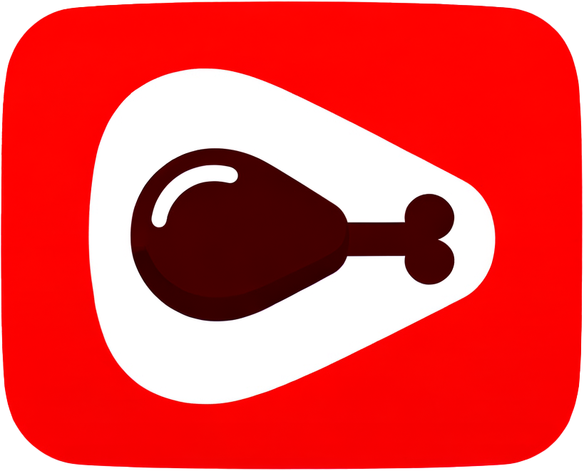

# MeaTube - a YouTube-like platform for those who like meat 
MeaTube is a social media application inspired by platforms like YouTube. It provides both a web client and an Android app for users to connect and share videos, support the grill-men and add replies and thoughts to their content. This WIKI provides an overview of the project, installation instructions, and details about its components.

## Team
- [Oran Zafrani](https://github.com/Oran-Zafrani)
- [Ofri Kastenbaum](https://github.com/Ofrikas)
- [Bar Shwarts](https://github.com/BarShwarts1)
